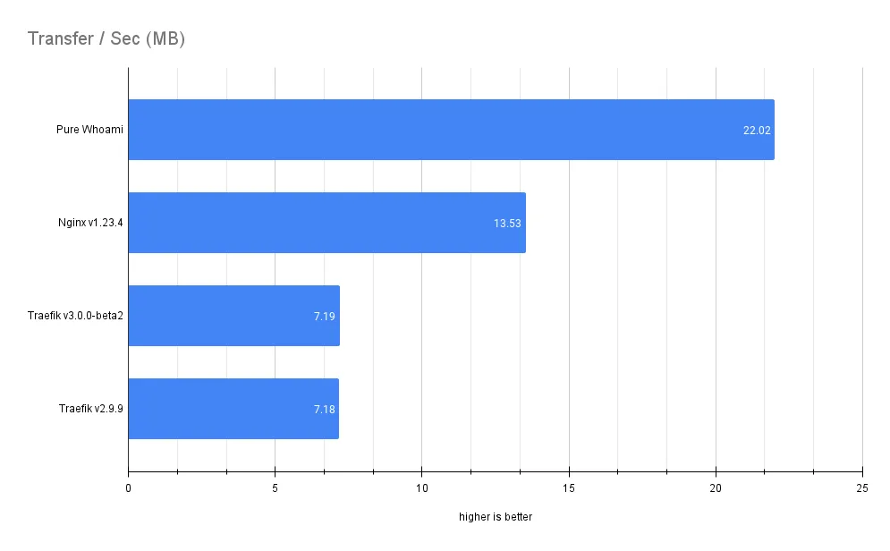

# Traefik vs Nginx

## Performance:

## Main difference:

Traefik provides dynamic configuration and service discovery capabilities, compared to Nginx’s static configuration files requiring manual updates for routing traffic.

Schema of configuration:

## Why traefik is the best solution?

1. Traefik deployment is also k8s operator, therefore you can configure it as yaml [convenient Custom Resources](https://doc.traefik.io/traefik/middlewares/http/stripprefixregex/#configuration-examples).
2. Traefik reads configuration in fly, directly from the Kubernetes provider (crd stored in ETCD), you don’t have to restart the process (container in our case) to apply the changes in routing. Treafik doesn’t rely on static configuration files, stored somewhere in the filesystem. 
3. You can expose TCP/UDP services easily with DNS, the routing is based on the certificate that is mounted to the ingress.
4. Integrated Let’s Encrypt SSL certifications issuing.
5. Traefik supports dynamic service discovery and automatically routes traffic based on service name, label, and other metadata. This means that as new services are added or removed, Traefik automatically adjusts routing to ensure traffic is routed to the correct backend servers.
6. [Load balancing](https://doc.traefik.io/traefik/routing/services/#load-balancing) with the Traefik algorithm is more advanced, providing a variety of options including round-robin, random, and weighted load balancing. What is more, Traefik also automatically adjusts its load balancing based on the availability of backend servers, ensuring that traffic is routed to healthy servers and avoiding those that are experiencing issues. It is possible to configure canary deployments.
7. If you prefer visual debugging, there is a dashboard that will show you the truth:

## Why Nginx is the best solution?

1. Nginx is more popular

1. Traefik ingress controller deployment is relatively complex at the beginning
2. Nginx is great in serving static content and caching, traefik is not able to serve static content, it is only the proxy. In our case it should not be the problem.
3. The most popular Nginx helm installation of ingress controller uses non DockerHub registry, without a daily pull limit. Traefik on the other hand, uses DockerHub, by default.
4. There are some problems with traefik release of version v3, it is not ready for so long… 
5. In the current stable version, it lacks compatibility with grafana tempo

- Bibliography:
    
    [Nginx vs Traefik: how slower one can be better?](https://devforth.io/blog/nginx-vs-traefik-how-slower-one-can-be-better/)
    
    [Is Nginx dead? Is Traefik v3 20% faster than Traefik v2?](https://medium.com/beyn-technology/is-nginx-dead-is-traefik-v3-20-faster-than-traefik-v2-f28ffb7eed3e)
